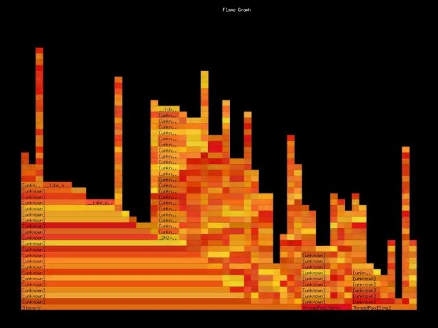

# go-profile

An *incomplete* port of [brendangregg](https://github.com/brendangregg)'s eBPF profiling application [profile.py](https://github.com/iovisor/bcc/blob/master/tools/profile.py) to Golang.

Please read Brendan Gregg's Blog post [Linux 4.9's Efficient BPF-based Profiler](https://www.brendangregg.com/blog/2016-10-21/linux-efficient-profiler.html) for more information.

This project required changes to the Golang standard library to support some features ([debug/elf: add SHT_GNU_VERDEF section parsing](https://github.com/golang/go/issues/63952)). Special thanks to [ianlancetaylor](https://github.com/ianlancetaylor) and [aclements](https://github.com/aclements) for guiding me through the submission process.

## Options

| Option                   | Description                                                                                                 |
|--------------------------|-------------------------------------------------------------------------------------------------------------|
|                          | Duration in seconds (positional argument, default: 99999999)                                                |
| -F                       | Sample frequency in Hz (default: 49)                                                                        |
| -c                       | Sample period, number of events (default: 10)                                                                 |
| -p                       | Profile process with one or more comma-separated PIDs only                                                  |
| -L                       | Profile thread with one or more comma-separated TIDs only                                                   |
| -hash-storage-size       | The number of hash keys that can be stored (default: 40960)                                                   |
| -stack-storage-size      | The number of unique stack traces that can be stored and displayed (default: 16384)                           |
| -C                       | CPU number to run profile on (default: -1)                                                                    |
| -U                       | Show stacks from user space only (no kernel space stacks)                                                   |
| -K                       | Show stacks from kernel space only (no user space stacks)                                                   |
| -d                       | Insert delimiter between kernel/user stacks                                                                 |
| -a                       | Add _[k] annotations to kernel frames                                                                       |
| -I                       | Include CPU idle stacks                                                                                       |
| -f                       | Output folded format, one line per stack (for flame graphs)                                                 |
| -cgroupmap               | Trace cgroups in this BPF map only                                                                          |
| -mntnsmap                | Trace mount namespaces in this BPF map only                                                                 |
| -E                       | Enable flame graph frame generation                                                                         |
| -g                       | File name pattern for flame graph frame generation (default: 'frames/flamegraph%04d.png')                      |
| -T                       | Enable flame graph realtime feed                                                                            |
| -P                       | HTTP path for flame graph realtime feed (default: '/')                                                      |
| -R                       | Port for flame graph realtime feed (default: 9090)                                                            |

## Generate eBPF Go Bindings

To compile the eBPF programs and generate the corresponding Go bindings, run the following command:

```sh
$ BPF_CFLAGS='-D__TARGET_ARCH_x86' go generate ./cmd/profile/
```

## Example
```sh
$ sudo /usr/local/go/bin/go run ./cmd/profile -p 2197 100
Waiting for stack traces for 1m40s...

    [U] 7f4d99a0112d [unknown]
    [U] 7f4d99a0021d __isoc99_fscanf
    -                htop (2197)
        1
    [K] ffffffff853bd36e do_task_stat
    [K] ffffffff853bd36e do_task_stat
    [K] ffffffff853b70ed proc_single_show
    [K] ffffffff853574a0 seq_read_iter
    [K] ffffffff8535792a seq_read
    [K] ffffffff85326855 vfs_read
    [K] ffffffff85326c2f ksys_read
    [K] ffffffff85f22e55 do_syscall_64
    [K] ffffffff86000124 entry_SYSCALL_64_after_hwframe
    [U] 7f4d99ab27e2 read
    [U] 00000040 [unknown]
```

## More Examples

| Command                                   | Description                                                            |
|-------------------------------------------|------------------------------------------------------------------------|
| `./profile`                        | Profile stack traces at 49 Hertz until Ctrl-C                          |
| `./profile -F 99`                  | Profile stack traces at 99 Hertz                                       |
| `./profile -c 1000000`             | Profile stack traces every 1 in a million events                       |
| `./profile 5`                      | Profile at 49 Hertz for 5 seconds only                                 |
| `./profile -f 5`                   | Output in folded format for flame graphs                               |
| `./profile -p 185`                 | Only profile process with PID 185                                      |
| `./profile -L 185`                 | Only profile thread with TID 185                                       |
| `./profile -U`                     | Only show user space stacks (no kernel)                                |
| `./profile -K`                     | Only show kernel space stacks (no user)                                |
| `./profile --cgroupmap mappath`      | Only trace cgroups in this BPF map                                     |
| `./profile --mntnsmap mappath`       | Only trace mount namespaces in the map                                 |
| `./profile -T`                     | Enable flame graph realtime feed (defaults: `http://localhost:9090/`)    |
| `./profile -E`                     | Enable flame graph frame generation (default: `frames/flamegraph%04d.png`) |

## Video

[](https://www.youtube.com/watch?v=LL-KoHnRfSM "Realtime Flame Graph")

To generate a video from the generated frames:
```sh
$ ffmpeg -framerate 30 -i ./frames/flamegraph%04d.png flamegraph.mp4
```

## Headers

Note, the headers were copied from the following sources:

```sh
$ git clone https://github.com/cilium/ebpf.git
$ cp ./ebpf/examples/headers/bpf_helpers.h ./headers/bpf
$ cp ./ebpf/examples/headers/bpf_helper_defs.h ./headers/bpf
$ cp ./ebpf/examples/headers/bpf_tracing.h ./headers/bpf
$ cp ./ebpf/btf/testdata/bpf_core_read.h ./headers/bpf
```

## vmlinux.h

`vmlinux.h` was generated as follows:

```sh
$ sudo apt-get install linux-tools-common linux-tools-generic
$ bpftool btf dump file /sys/kernel/btf/vmlinux format c > ./headers/vmlinux.h
```
